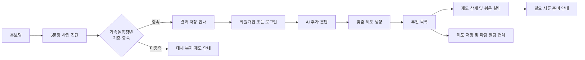

# CareON Web

가족을 돌보는 청년이 자신의 상황을 간단히 확인하고, AI 추가 문답을 거쳐 신청 가능한 복지 제도를 추천받을 수 있도록 만든 웹 프런트엔드입니다.

CareON Web은 단순히 제도 목록을 보여주는 데서 끝나지 않습니다. 사전 진단, 회원 인증, 대화형 정보 수집, 맞춤 제도 추천, 제도 저장, 쉬운 설명, 신청 서류 준비 안내까지 하나의 흐름으로 연결합니다.

> 이 저장소는 프런트엔드 애플리케이션만 포함합니다. 로그인, 추천 결과, 제도 저장, AI 상담 등의 전체 기능을 사용하려면 Web API와 AI API 서버가 필요합니다.

## 주요 사용자 흐름



기존 사용자가 다시 접속하면 브라우저에 저장된 액세스 토큰으로 사용자 정보, 최근 완료된 AI 상담 결과, 저장한 제도를 복원합니다. 완료된 추천 결과가 있으면 곧바로 맞춤 제도 화면으로 이동하고, 추가 문답이 남아 있으면 상담 화면부터 이어서 진행합니다.

## 주요 기능

### 1. 가족돌봄청년 사전 진단

- 회원가입 전에 바로 시작할 수 있습니다.
- 나이, 서울 거주 여부, 돌봄 대상자의 일상생활 어려움, 법적 가족 관계, 직접 돌봄·생계 책임, 돌봄으로 인한 생활 어려움까지 총 6개 항목을 확인합니다.
- 모든 문항에 답할 때까지 대화형 UI로 질문과 답변을 순서대로 보여줍니다.
- 6개 기준을 모두 충족하면 결과 저장과 정밀 추천을 위한 회원가입·로그인을 안내합니다.
- 기준을 충족하지 못하면 실패한 조건에 맞는 설명과 대체 복지 제도를 제공합니다.
- 비회원 상태로 결과 저장을 건너뛰어도 대체 제도를 확인할 수 있습니다.

### 2. 회원가입, 로그인, 비밀번호 재설정

- 이름 또는 닉네임, 이메일, 비밀번호, 서울시 자치구, 필수 약관 동의 정보를 받아 가입합니다.
- 로그인 성공 후 Bearer 액세스 토큰을 저장하고 사용자 세션을 복원합니다.
- 비밀번호 재설정 메일 발송과 메일 링크의 토큰을 이용한 새 비밀번호 설정을 지원합니다.
- `/reset-password`, `?token=...`, `?resetToken=...` 형식을 모두 재설정 진입 경로로 인식합니다.
- 인증이 만료되어 API가 `401`을 반환하면 로컬 세션을 정리하고 로그인 화면으로 이동합니다.

### 3. AI 기반 추가 문답

- 가입 직후 또는 돌봄 상황이 바뀐 경우 AI 상담 스레드를 생성합니다.
- 사용자의 자유 입력을 AI API로 전송하고, 응답 메시지를 채팅 형태로 이어서 표시합니다.
- 한글 입력기 조합 중 Enter가 중복 전송되지 않도록 IME 조합 상태를 구분합니다.
- AI 응답 단계가 `ready`가 되면 3초 카운트다운 후 맞춤 제도 결과를 불러옵니다.
- 상담 스레드가 만료되어 `404`가 반환되면 새 스레드를 생성하고 다시 입력하도록 안내합니다.
- 기존 추천 화면에서도 별도의 상담 화면을 열어 상황을 보완하고 추천 결과를 갱신할 수 있습니다.

### 4. 맞춤 제도 추천과 저장

- AI 결과의 `banner`, `matched`, `maybe` 영역을 하나의 화면 모델로 정규화합니다.
- 동일한 제도가 여러 추천 영역에 포함되어도 ID를 기준으로 중복을 제거합니다.
- 추천 제도를 “추천드려요”와 “이런 제도들은 어떠세요?” 영역으로 나눠 표시합니다.
- 사용자가 저장한 제도는 “내가 선택한 제도” 영역에 별도로 모아 보여줍니다.
- 저장 시 API에는 제도의 `serv_id`를 전달하고, 저장 취소 시 서버가 발급한 `saved_policy_id`를 사용합니다.
- 저장 목록을 변경한 뒤 서버 데이터를 다시 조회하여 화면 상태와 서버 상태를 일치시킵니다.
- 웹에서는 제도 저장과 앱 설치 상태를 연계합니다. 실제 마감일 알림 수신은 CareON 앱 사용을 안내하며, 이 저장소 자체가 PWA 설치나 푸시 알림을 구현하는 것은 아닙니다.

### 5. 제도 상세와 쉬운 설명

- 제도명, 담당 기관, 요약, 지원 기간, 신청 방법, 신청 기간, 결과 발표일, 문의처를 제공합니다.
- 상세 정보는 최초 조회 후 메모리 캐시에 보관하여 같은 제도를 다시 열 때 불필요한 요청을 줄입니다.
- AI 번역 API를 호출해 어려운 공고 내용을 쉬운 문장과 신청 가이드로 보여줍니다.
- 복지 서비스의 `serv_id`가 있는 제도와 기존 등록형 정책을 구분해 각각 알맞은 상세·번역 API를 호출합니다.
- 상세 화면은 모달형 오버레이로 열리며 바깥 영역 클릭 또는 `Escape` 키로 닫을 수 있습니다.
- 원문 확인이 필요한 경우 공식 사이트를 새 탭으로 엽니다.

### 6. 필요 서류와 신청 양식 안내

- API의 필요 서류(`requiredDocuments`)와 신청 양식·관련 자료(`requiredForms`)를 분리해 표시합니다.
- 주민등록등본, 가족관계증명서, 소득금액증명 등 자주 쓰는 서류에는 발급처, 준비 순서, 공식 발급 링크를 제공합니다.
- 띄어쓰기나 명칭 차이가 있는 서류는 별칭 테이블로 표준화합니다.
- 미등록 서류도 이름의 키워드를 분석해 병원, 회사, 학교, 금융기관 등 적절한 준비 경로를 안내합니다.
- 신청서·동의서·양식은 작성 서류로, 지침·조례·매뉴얼은 참고 자료로, 나머지는 첨부 자료로 분류합니다.
- 외부 URL은 정부·공공기관 공식 도메인인지 확인한 뒤에만 버튼으로 노출합니다. 검증되지 않은 API 응답 URL은 실행 링크로 사용하지 않습니다.

### 7. 마이페이지와 계정 관리

- 이름 또는 닉네임, 비밀번호, 거주 지역을 변경할 수 있습니다.
- 민감한 정보 변경 전 현재 비밀번호로 다시 인증합니다.
- 변경 전·후 값을 모달에서 확인할 수 있습니다.
- 로그아웃과 회원 탈퇴를 지원합니다.
- 가입 직후 추가 문답을 완료하지 않고 메인으로 나가려는 경우, 방금 만든 가입 기록이 삭제된다는 점을 확인받습니다.

### 8. 반응형 UI와 접근성

- 데스크톱에서는 제도 상세 정보와 AI 쉬운 설명을 2열로 배치하고, 작은 화면에서는 1열로 전환합니다.
- `61.25rem` 이하 화면에서 카드, 채팅, 상세 패널, 모달을 모바일 레이아웃으로 재배치합니다.
- 진행 상태, 로딩 상태, 채팅 전환 상태에 `aria-label`, `role="status"`, `aria-live`를 사용합니다.
- 선택형 UI에는 `aria-pressed`, 상세 및 서류 안내에는 dialog 역할을 적용합니다.
- `prefers-reduced-motion` 환경에서는 주요 로딩·전환 애니메이션을 줄입니다.

## 기술 스택

| 구분 | 기술 | 사용 목적 |
| --- | --- | --- |
| UI | React 19 | 함수형 컴포넌트와 Hooks 기반 화면 구성 |
| 빌드 도구 | Vite 8 | 개발 서버, HMR, 프로덕션 번들 생성 |
| 언어 | JavaScript, JSX | 애플리케이션과 UI 로직 구현 |
| 스타일 | CSS | 디자인 토큰, 반응형 레이아웃, 애니메이션 구현 |
| 통신 | Fetch API | Web API와 AI API 호출 |
| 상태 관리 | React Hooks | 화면, 사용자, 추천, 저장 목록, 모달 상태 관리 |
| 내비게이션 | History API | 별도 라우터 없이 화면 상태와 뒤로가기 처리 |
| 테스트 | Node.js Test Runner | 신청 서류 분류 및 공식 URL 정책 검증 |
| 정적 분석 | ESLint 10 | JavaScript, React Hooks, Fast Refresh 규칙 검사 |
| 배포 설정 | Vercel Rewrites | SPA 경로를 `index.html`로 연결 |

Redux, React Router, Axios, CSS 프레임워크는 사용하지 않습니다. 공통 상태와 화면 전환은 `App.jsx`, HTTP 통신과 응답 변환은 `src/lib/api.js`에 집중되어 있습니다.

## 구현 구조

### 화면 상태 기반 SPA

`App.jsx`가 애플리케이션의 오케스트레이터 역할을 합니다. 현재 화면을 나타내는 `view` 상태에 따라 온보딩, 진단, 결과, 인증, 상담, 추천, 상세, 마이페이지를 렌더링합니다.

일반 화면 전환은 URL별 라우트가 아니라 `window.history.pushState()`로 히스토리를 쌓고 `popstate` 이벤트로 뒤로가기를 처리합니다. 비밀번호 재설정만 메일 링크 진입이 필요하므로 URL 경로와 쿼리 토큰을 별도로 해석합니다.

각 페이지는 `React.lazy()`와 `Suspense`로 지연 로딩합니다. 진단 결과 분석 중에는 대체 제도 요청과 결과 페이지 번들 로딩을 병렬로 처리하고, 최소 1.5초의 분석 상태와 완료 전환 효과를 거쳐 결과를 표시합니다.

### 상태 소유권

`App.jsx`가 다음 전역 수준 상태를 소유하고 페이지에는 필요한 값과 이벤트만 props로 전달합니다.

- 사용자와 인증 상태
- 사전 진단 답변
- AI 추천 원본 결과
- 정규화된 추천 제도와 저장 제도
- 선택한 제도와 상세 패널 상태
- 추천·대체 제도 로딩 및 오류
- 앱 설치 안내, 재방문 확인, 가입 이탈 확인 모달

페이지 내부에서만 필요한 입력 폼, 채팅 메시지, 서류 안내 선택 상태는 해당 페이지 또는 컴포넌트의 로컬 상태로 관리합니다.

### API 클라이언트와 데이터 정규화

`src/lib/api.js`의 공통 `request()` 함수가 다음 작업을 담당합니다.

1. 환경 변수에 맞는 Base URL과 API 경로 결합
2. JSON 요청 본문과 `Content-Type` 구성
3. 인증 요청의 `Authorization: Bearer <token>` 추가
4. 응답 본문 파싱
5. 실패 응답을 상태 코드와 오류 코드를 가진 `ApiError`로 변환

백엔드와 AI 서버가 `snake_case` 또는 `camelCase` 중 어느 형식으로 값을 반환해도 화면에서는 동일한 모델을 사용하도록 사용자, 정책, 챗봇 스레드, 추천 결과, 필요 서류를 정규화합니다.

API에서 받은 제도는 대략 다음 화면 모델로 변환됩니다.

```js
{
  id,
  servId,
  source,
  title,
  agency,
  summary,
  period,
  deadline,
  method,
  resultTime,
  requiredDocuments,
  requiredForms,
  savedPolicyId,
}
```

추천 결과와 저장 결과를 합칠 때는 ID별 `Map`을 사용합니다. 상세 조회로 보강된 값, 저장 ID, 매칭 그룹, 수혜 여부 같은 상태가 이후 응답 때문에 사라지지 않도록 기존 값과 새 값을 선택적으로 병합합니다.

### 브라우저 저장소

다음 값은 `localStorage`에 저장합니다.

| 키 | 역할 |
| --- | --- |
| `careon:webAccessToken` | 인증 요청에 사용하는 액세스 토큰 |
| `careon:followupPending` | 추가 문답을 먼저 진행해야 하는지 표시 |
| `careon:followupCompleted` | 추가 문답 완료 여부 표시 |

로그아웃, 회원 탈퇴, 인증 만료 시 사용자 상태와 토큰을 정리합니다. 액세스 토큰을 `localStorage`에 저장하는 구조이므로 운영 환경에서는 XSS 방지 정책과 토큰 만료 시간을 함께 관리해야 합니다.

### 사용 중인 API 영역

| 영역 | 대표 경로 | 역할 |
| --- | --- | --- |
| 인증 | `/api/web/users/login`, `/api/web/users/register` | 로그인, 회원가입 |
| 사용자 | `/api/web/users/me` | 내 정보 조회, 수정, 탈퇴 |
| 비밀번호 | `/api/web/users/password/reset-link`, `/api/web/users/password/reset` | 재설정 링크 발송과 비밀번호 변경 |
| 대체 제도 | `/api/web/policies/alternatives` | 사전 진단 미충족 또는 비회원용 제도 조회 |
| 저장 제도 | `/api/web/users/me/saved-policies` | 저장 목록 조회, 추가, 삭제 |
| AI 문답 | `/api/v1/cb/threads`, `/api/v1/cb/messages` | 스레드 생성과 대화 진행 |
| AI 추천 | `/api/v1/cb/threads/:threadId/results` | 완료된 맞춤 추천 결과 조회 |
| 기관 상세 | `/api/v1/cb/institutions/:servId` | 추천 제도 상세 정보 조회 |
| 쉬운 설명 | `/api/v1/cb/institutions/:servId/translate` | 공고와 신청 방법을 쉬운 문장으로 변환 |

`api.js`에는 진단 프로필, 돌봄 대상자, 소득 신호, 관심 정책 유형, 문서 이력, 기존 세션형 채팅 등 확장을 위한 메서드도 포함되어 있습니다. 현재 화면에서 직접 호출하는 API와 향후 연동을 위해 준비된 API가 함께 있으므로, 실제 사용 여부는 `src`에서 `api.<메서드명>` 참조를 검색해 확인할 수 있습니다.

## 프로젝트 구조

```text
careon-front-web/
├── public/
│   └── favicon.svg
├── src/
│   ├── assets/                  # 로고, 챗봇, 상태 이미지
│   ├── components/
│   │   ├── common/             # Button, Modal, TextField
│   │   ├── diagnosis/          # 진단 대화, 답변, 진행률
│   │   ├── layout/             # 공통 셸과 채팅 패널
│   │   └── programs/           # 제도 카드, 필터, 상세 패널
│   ├── constants/
│   │   ├── diagnosisQuestions.js
│   │   ├── seoulDistricts.js
│   │   └── supportTypes.js
│   ├── data/
│   │   ├── documentGuides.js       # 서류명 정규화와 준비 안내
│   │   └── documentGuides.test.js  # 서류 안내 정책 테스트
│   ├── lib/
│   │   └── api.js              # API 호출, 오류 처리, 응답 정규화
│   ├── pages/                   # 기능별 페이지 컴포넌트
│   ├── App.jsx                 # 화면 전환과 전역 수준 상태 조정
│   ├── App.css                 # 서비스 UI와 반응형 스타일
│   ├── index.css               # 전역 토큰과 기본 스타일
│   └── main.jsx                # React 진입점
├── eslint.config.js
├── vite.config.js              # React 플러그인과 개발 프록시
├── vercel.json                 # SPA rewrite
└── package.json
```

## 로컬 실행 방법

### 1. 실행 환경

- Node.js `20.19.0` 이상인 20.x, `22.13.0` 이상인 22.x, 또는 24 이상
- npm
- Web API 및 AI API 서버

Node.js 버전 조건은 현재 사용 중인 Vite 8과 ESLint 10의 엔진 요구사항을 함께 반영한 것입니다.

### 2. 의존성 설치

```bash
npm install
```

### 3. 환경 변수 설정

프로젝트 루트에 `.env.local` 파일을 만들고 필요한 API 주소를 설정합니다.

```dotenv
VITE_API_BASE_URL=https://api.example.com
VITE_AI_API_BASE_URL=https://ai-api.example.com
```

| 변수 | 필수 여부 | 설명 |
| --- | --- | --- |
| `VITE_API_BASE_URL` | 선택 | 회원, 정책, 저장 제도 등 Web API 주소 |
| `VITE_AI_API_BASE_URL` | 선택 | AI 상담, 추천 결과, 쉬운 설명 API 주소 |

환경 변수 사용 규칙은 다음과 같습니다.

- `VITE_AI_API_BASE_URL`이 없으면 `VITE_API_BASE_URL`을 AI API에도 사용합니다.
- 두 변수가 모두 없으면 현재 Origin의 상대 경로로 요청합니다.
- 개발 서버에서 상대 `/api` 요청은 `vite.config.js`에 따라 `http://localhost:8080`으로 프록시됩니다.
- Base URL 뒤에는 `/`를 붙이지 않는 것을 권장합니다. 코드가 `/api/...` 경로를 바로 이어 붙입니다.
- Vite 환경 변수는 빌드 시점에 포함되므로 값을 변경한 뒤 개발 서버를 다시 시작해야 합니다.
- `VITE_` 접두사가 붙은 값은 클라이언트 번들에 노출됩니다. API Base URL만 설정하고 토큰이나 비밀 키는 넣지 않습니다.
- `.env.local`은 Git에서 제외되어 있으며 커밋하지 않습니다.

Web API와 AI API가 모두 로컬 `http://localhost:8080`에서 제공된다면 환경 변수를 비워둔 상태로 개발 프록시를 사용할 수 있습니다. 두 서버의 주소가 다르면 각각의 환경 변수를 설정하고 해당 서버의 CORS 설정을 확인해야 합니다.

### 4. 개발 서버 실행

```bash
npm run dev
```

터미널에 출력된 로컬 주소로 접속합니다.

### 5. 프로덕션 빌드와 미리보기

```bash
npm run build
npm run preview
```

빌드 결과는 `dist/`에 생성됩니다.

## 사용 가능한 명령어

| 명령어 | 설명 |
| --- | --- |
| `npm run dev` | Vite 개발 서버와 HMR 실행 |
| `npm run build` | 프로덕션 번들 생성 |
| `npm run preview` | 생성된 번들을 로컬에서 미리보기 |
| `npm run lint` | 전체 JavaScript와 JSX 정적 분석 |
| `npm test` | Node.js Test Runner로 테스트 실행 |

## 테스트

현재 자동화 테스트는 신청 서류 안내의 정확성과 외부 링크 안전 정책에 집중되어 있습니다.

- 의료급여증, 입양사실확인서 등 특수 서류의 발급처 확인
- 신청서·동의서·참고 자료 분류 우선순위 확인
- 서류 별칭과 공식 증명서 연결 확인
- 검증된 공공기관 도메인만 외부 링크로 노출하는지 확인
- API가 전달한 비공식 URL이 공식 발급 링크를 덮어쓰지 않는지 확인

변경 사항을 제출하기 전 다음 명령을 차례로 실행하는 것을 권장합니다.

```bash
npm test
npm run lint
npm run build
```

## 배포

`vercel.json`은 모든 요청을 `/index.html`로 다시 작성하여 새로고침이나 비밀번호 재설정 링크로 직접 접근해도 SPA가 실행되도록 설정합니다.

Vercel에 배포할 때는 프로젝트 환경 변수에 `VITE_API_BASE_URL`과 `VITE_AI_API_BASE_URL`을 등록한 뒤 다시 빌드해야 합니다. 운영 인프라가 같은 도메인의 `/api`를 백엔드로 먼저 전달하도록 구성된 경우에만 환경 변수를 생략하고 상대 경로 방식을 사용할 수 있습니다. 현재의 전체 경로 SPA rewrite보다 API 라우팅이 우선하는지도 함께 확인해야 합니다.

## 개발 시 참고 사항

- 새로운 최상위 화면을 추가할 때는 페이지 컴포넌트를 만들고 `App.jsx`의 지연 로딩 선언과 `renderView()` 분기에 화면 상태를 연결합니다.
- 새 API 응답은 페이지에서 직접 가공하기보다 `src/lib/api.js`에 정규화 함수를 추가해 화면 모델을 일정하게 유지합니다.
- 추천 제도 ID는 복지 서비스의 문자열 `serv_id`와 등록형 정책의 숫자 ID가 함께 존재할 수 있으므로 임의로 숫자 변환하지 않습니다.
- 저장 취소에는 제도 ID가 아니라 저장 레코드의 `saved_policy_id`가 필요합니다.
- 신청 서류 안내를 확장할 때는 `DOCUMENT_GUIDES` 또는 별칭을 추가하고 `documentGuides.test.js`에 공식 URL과 분류 동작을 함께 검증합니다.
- 외부 링크 허용 도메인을 넓힐 때는 `isTrustedOfficialUrl()`의 보안 범위와 테스트를 함께 수정합니다.
- 별도 라우터를 도입하려면 현재 `view`, `pushState`, `popstate`, 비밀번호 재설정 URL 처리의 역할을 모두 대체하는지 확인해야 합니다.
